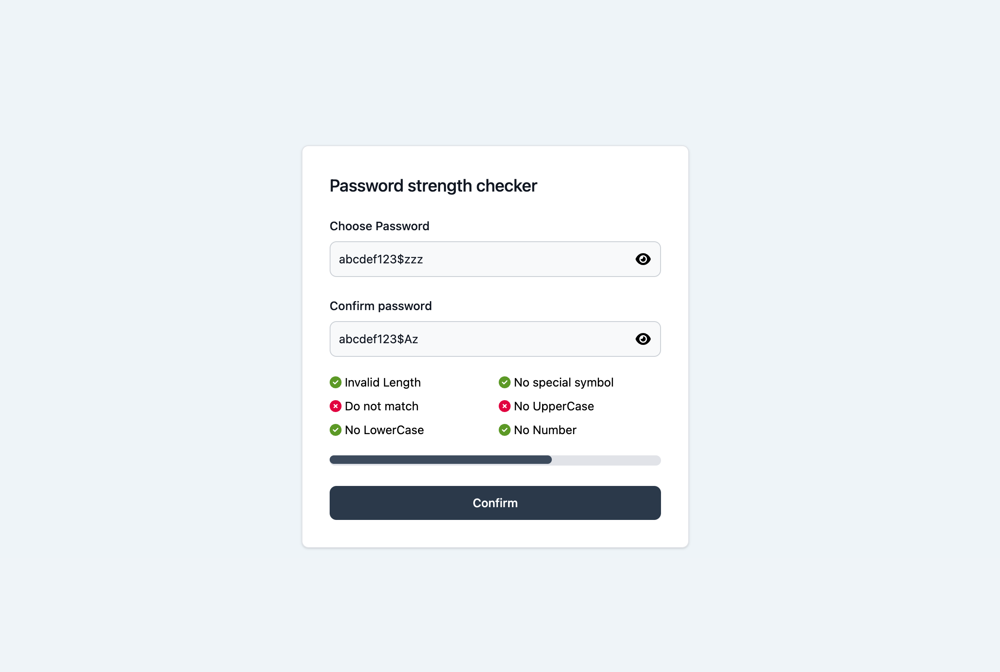

# Password Strength Checker

Password Strength Checker is an Angular application that allows users to check the strength of their passwords against various criteria. It provides real-time feedback on password strength.

## Component Preview

## Features

- Check password strength against the following criteria:
  - Valid length
  - At least one special symbol
  - At least one uppercase letter
  - At least one lowercase letter
- Confirm password to ensure a match
- Real-time feedback and error messages
- User-friendly interface
- Progress bar
